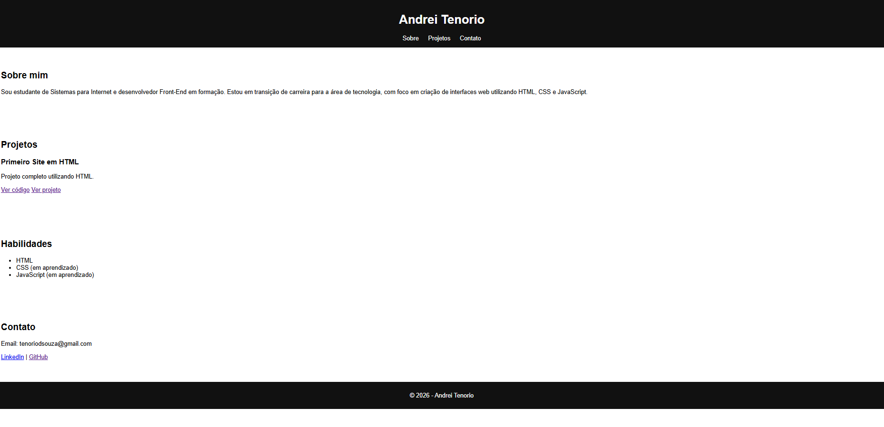

# 💻 Portfólio Web | Andrei Tenorio

Este é o meu portfólio pessoal desenvolvido com HTML e CSS, criado com o objetivo de apresentar meus projetos, habilidades e evolução na área de desenvolvimento web.

---

## 🚀 Acesse o projeto online

🔗 https://tenoriodsouza-svg.github.io/portfolio-web/

---

## 📌 Sobre o projeto

Este portfólio foi desenvolvido como parte da minha transição de carreira para a área de tecnologia, com foco em desenvolvimento Front-End.

A proposta é reunir meus projetos, demonstrar minhas habilidades e acompanhar minha evolução prática ao longo dos estudos.

---

## 🛠️ Tecnologias utilizadas

- HTML5  
- CSS3  

---

## 📚 Aprendizados

Durante o desenvolvimento deste projeto, pude reforçar conceitos importantes como:

- Estruturação de páginas com HTML  
- Organização de conteúdo  
- Estilização com CSS  
- Criação de layout simples e funcional  

---

## 📁 Estrutura do projeto
📦 portfolio-web
┣ 📄 index.html
┣ 📄 style.css
┣ 📄 readme.md
┗ 📁 assets

---

## 🖼️ Preview do projeto

---

## 📬 Contato

- 📧 Email: tenoriodsouza@gmail.com  
- 🔗 LinkedIn: https://www.linkedin.com/in/andrei-tenorio  
- 💻 GitHub: https://github.com/tenoriodsouza-svg  

---

## 🎯 Objetivo

Este projeto faz parte da minha jornada de aprendizado contínuo em desenvolvimento web, com o objetivo de evoluir até me tornar um desenvolvedor Full Stack.

---

## 🚀 Status

🟢 Em desenvolvimento — melhorias e novos projetos serão adicionados continuamente.

---

✨ Desenvolvido por Andrei Tenorio de Souza
